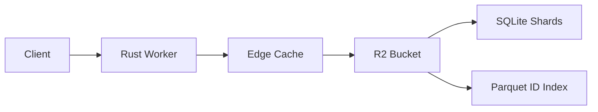

# Overture Geocoder

A high-performance forward and reverse geocoder built on [Overture Maps](https://overturemaps.org/) data, powered by **Rust**, **Cloudflare Workers**, and **R2**.

## Features

- **Global Coverage**: 450K+ cities, neighborhoods, and administrative areas worldwide.
- **Serverless Architecture**: Runs entirely on Cloudflare Workers with zero persistent server management.
- **Cost-Effective**: Uses SQLite shards stored in R2 to bypass database storage limits and minimize costs.
- **Fast Search**: Full-Text Search (FTS5) with prefix matching for autocomplete.
- **Reverse Geocoding**: Routes from requested coordinates when one country bbox is unambiguous, then performs bbox-based hierarchical lookup. Overlapping or legacy metadata falls back to IP country.
- **GERS ID Lookup**: Resolve any Overture GERS ID to its bounding box via UUID-prefix-sharded parquet index.
- **Zero Egress**: Client-side libraries can fetch full geometry directly from Overture's S3 buckets.

## API

Base URL: `https://geocoder.bradr.dev`

### Forward Geocoding (Search)

**Endpoint:** `GET /search`

| Parameter | Type | Default | Description |
|-----------|------|---------|-------------|
| `q` | string | required | Search query (e.g., "Boston", "New York") |
| `limit` | int | 10 | Max results to return (1-40) |
| `autocomplete` | bool | true | Enable prefix matching for the last token |
| `format` | string | json | Response format: `json` or `geojson` |
| `debug` | bool | false | Include debug info (shards loaded, user location) |

**Example:**
```bash
curl "https://geocoder.bradr.dev/search?q=boston&limit=1"
```

**Response:**
```json
{
  "results": [
    {
      "gers_id": "...",
      "name": "Boston",
      "type": "locality",
      "lat": 42.3601,
      "lon": -71.0589,
      "bbox": [ ... ],
      "importance": 0.85,
      "country": "US",
      "region": "US-MA"
    }
  ]
}
```

### Reverse Geocoding

**Endpoint:** `GET /reverse`

| Parameter | Type | Default | Description |
|-----------|------|---------|-------------|
| `lat` | float | required | Latitude (-90 to 90); used for reverse lookup and country-shard routing |
| `lon` | float | required | Longitude (-180 to 180) |

**Example:**
```bash
curl "https://geocoder.bradr.dev/reverse?lat=42.3601&lon=-71.0589"
```

### GERS ID Lookup

**Endpoint:** `GET /id/:gers_id`

Resolves any Overture GERS ID to its bounding box.

**Example:**
```bash
curl "https://geocoder.bradr.dev/id/08b2a100-d664-7fff-0200-a44bcea04b76"
```

**Response:**
```json
{
  "id": "08b2a100-d664-7fff-0200-a44bcea04b76",
  "bbox": {
    "xmin": -71.06,
    "ymin": 42.35,
    "xmax": -71.05,
    "ymax": 42.36
  }
}
```

## Architecture

This project uses a **sharded architecture** to handle global datasets within the constraints of serverless edge computing.

1.  **Data Ingestion**: DuckDB extracts division data from Overture Maps' S3 buckets (Parquet format).
2.  **Shard Generation**:
    *   `scripts/build_shards.py` partitions divisions by country/region into optimized **SQLite databases** with FTS5 indexes.
    *   `scripts/build_id_index.py` builds a **UUID-prefix-sharded parquet index** mapping every GERS ID to its bounding box. Streams from Overture's registry and release themes via DuckDB, stages partitioned parquet to R2, then merges into sorted snappy-compressed shards.
3.  **Storage**: All shards are uploaded to **Cloudflare R2** (`geocoder-shards` bucket), versioned by date.
4.  **Runtime**: The **Rust Worker** (`crates/geocoder-worker`) dynamically fetches shards from R2, caches at the edge via the Cache API, and queries them for each request.



## Performance

Measured 2026-06-12 against production from a single US-East client
(`scripts/benchmark_latency.py`, paced under the 60 req/min rate limit;
"cold" targets low-traffic shards likely absent from the edge cache,
"warm" repeats the same requests):

| endpoint | warm p50 | warm p95 | cold p50 |
|---|---|---|---|
| `/search` | 156ms | 4,822ms* | 274ms |
| `/reverse` | 36ms | 689ms | 192ms |
| `/id/{gers_id}` | 119ms | 5,749ms* | 465ms |

\* tail samples are first-touch loads of multi-MB shards on a fresh
isolate or evicted edge cache; warm-isolate requests typically answer
in 30-160ms. Run-to-run p50s vary roughly 2x with colo and cache state.

Result quality vs other open geocoders on the
[geocoder-tester](https://github.com/geocoders/geocoder-tester) global
city cases (`scripts/benchmark_geocoders.py`, 2026-06-11):

| | Overture | Nominatim | Photon |
|---|---|---|---|
| Top-1 name match | **80%** | 67% | 67% |
| p50 latency | 77ms | 65ms | 479ms |

Reproduce with:

```bash
python scripts/benchmark_latency.py --output run.json --compare benchmarks/2026-06-11-baseline.json
python scripts/benchmark_geocoders.py --limit 40 --warmup 1
```

## Development

### Prerequisites

*   Rust (latest stable)
*   Node.js & npm
*   Cloudflare Wrangler (`npm install -g wrangler`)
*   DuckDB + Python `duckdb` package (for data scripts)

### Build & Run Worker

```bash
cd crates/geocoder-worker
wrangler dev
```

### Generate Test Data

```bash
# Build US shards for local testing
./scripts/download_divisions.sh
python scripts/build_shards.py --countries US
```

### Deployment

Deploy the worker to Cloudflare:

```bash
cd crates/geocoder-worker
wrangler deploy
```

## GitHub Actions

### `Deploy Rust Worker`
Automatically deploys the worker to Cloudflare when CI passes on `main`.

### `Rebuild R2 Shards`
A scheduled workflow (monthly, 25th) that rebuilds all data from the latest Overture release. Runs two parallel jobs:

*   **Forward + Reverse shards**: Downloads divisions, builds SQLite shards, uploads to R2.
*   **ID Index**: Streams the Overture registry + release themes, builds UUID-prefix-sharded parquet, uploads to R2.

**Manual Trigger Inputs:**
*   `build_type`: `forward`, `reverse`, or `both`
*   `build_id_index`: Toggle ID index build (default: true)
*   `countries`: Comma-separated list (e.g., `US,CA`) to limit forward/reverse build
*   `confirm`: Type `REBUILD` to confirm

## License

MIT
