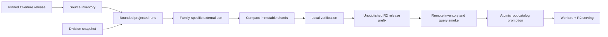

# Global Places + addresses processing design

Date: 2026-07-14

## Status and decision

This is a design for the next implementation spike, not approval to publish a
planet release.

Target standard GitHub-hosted runners as the self-sustaining producer, using
source-aware map/reduce jobs and R2 for intermediate fragments and final
artifacts. Keep the always-on factory as a reference benchmark and optional
manual fallback, not a required publisher. Cloudflare Workers continue to serve
R2; neither build environment is ever on the request path.

Build Places and addresses as separate families. They have different routing,
index, ranking, and correctness requirements and should share only the release,
manifest, checkpoint, upload, and promotion machinery.

The first planet attempt remains gated. Storage shape is encouraging, but
global extraction, address normalization, Places relevance, the packed-head
format, source locators, and release churn are not yet measured well enough to
justify a production build.

## What the evidence supports

| family | working count | measured compact shape | linear one-release diagnostic | important exclusion |
|---|---:|---:|---:|---|
| Places | 75M | 116.7 B/place on a 1M California-area sample | 8.75 GB, about 75 spatial shards | global head, aliases, multilingual coverage, typo index |
| addresses | 473M | 43.8 B/address on a reader-verified 3.63M Massachusetts artifact | 20.73 GB; roughly 120–240 shards at the proposed 2–4M-row target | source locators, raw address levels, parser indexes |
| existing ID index | 3.59B registry rows plus 944M current address/base rows | current production artifact | 138.6 GB, 4,096 shards | unchanged by this design initially |

These are planning numbers, not forecasts. The producer must inventory each
pinned release and replace every static count with exact source rows, bytes,
files, and row groups before a planet build starts.

Measured factory envelopes:

- Places 1M compact build: 23.2 seconds for final artifact assembly; the earlier
  Python page model peaked near 3.5 GiB.
- Address + division build: 3.63M rows in 137.5 seconds with 4 threads and a
  12 GB DuckDB limit, including a 102.1-second boundary-inclusive spatial join.
- Factory capacity: 20 logical CPUs, 62 GiB RAM, and roughly 1.4 TiB free during
  the experiments. Production limits remain 12 CPU, 48 GiB working memory, and
  700 GiB temporary disk.

## System shape



The producer has no inbound port and no serving responsibility. Scheduled or
manually dispatched GitHub workflows run only code merged to the protected
default branch. The factory remains manually invoked and never registers as a
runner for this public repository.

Cloudflare responsibilities stay intentionally small:

- R2 stores immutable shard objects, family manifests, and release manifests.
- Workers perform routing and bounded range reads.
- Workers Cache API caches immutable directories, lexical roots, and hot ranges.
- KV may cache only the tiny active-release pointer or routing directory. It is
  not a postings database.
- Analytics Engine is optional for aggregate latency/fanout observations.
- D1, Durable Objects, Queues, and a hosted Postgres service are not required for
  the first producer. Adding one must remove a measured bottleneck rather than
  becoming a second source of truth.

## Release and artifact namespace

Every run is pinned by Overture release and producer Git commit. It writes only
under a new immutable prefix:

```text
releases/{version}/
  source-inventory.json
  build-manifest.json
  divisions/
    collection.json
    ...
  places/
    routing.bin
    shards/{partition_id}.pidx
    head/{format_version}.phead       # absent until the head spike passes
    collection.json
  addresses/
    routing.bin
    dictionaries/{country}.adict
    shards/{partition_id}.aidx
    collection.json
  release.json
```

The prefix remains undiscoverable until finalization changes the root catalog;
no verified object is copied or renamed. A release manifest contains:

- Overture release, build ID, producer commit, and format versions.
- Exact input object path, ETag/size, row-group count, and selected row count.
- Every output key, byte length, SHA-256, record count, partition bounds, and
  source-inventory digest.
- Parent/split lineage and compatibility requirements for each partition.
- Family totals and verification results.

The root catalog changes once, after all required families and the ID index are
complete. Finalization is serialized with the existing production concurrency
group and uses a monotonic expected-current/version precondition; a slower older
build cannot overwrite a newer root pointer. Partial builds never become latest.
Retention runs only after live health, search, reverse, and ID smoke checks pass.
Keep at least three complete releases through the first global rehearsals.

## Partitioning rules

Partition IDs must be stable across releases. Rebalancing all boundaries to
equalize a monthly count would maximize churn and defeat content reuse.

### Places

Route located queries by country and a coarse spatial cell. Within that stable
cell, use deterministic child splits when the projected row count or artifact
bytes exceed the target. A practical key is:

```text
places/{country_or_XW}/{coarse_cell}/{split_path}
```

- Target about 1M rows and 96–192 MB per compact shard.
- Split above 1.5M rows or 256 MB using the next spatial bit/cell level.
- Do not automatically merge previously split children when a release shrinks.
- Preserve boundary rows in exactly one owning shard; routing metadata may list
  neighboring shards for radius queries without duplicating full records.
- Store the minimal self-contained search response: ID, primary name, basic
  category, administrative context, coordinates, and quantized confidence.
- Keep exact-token postings for name, brand, category, and selected context.
  Prefixes scan adjacent lexicon entries; do not materialize prefix unions.

Unlocated Places search is a separate bounded global-head problem. The current
head experiment produced 4,088 modeled objects and 25.1 MB for 1M rows. A
one-object range-readable head is still a proposal. Planet publication is
blocked until that format is built and its range fanout, bytes, relevance, and
release churn are measured. Tail-complete global POI enumeration is not an
initial API promise.

### Addresses

Address routing starts with structured context, not a global free-text token
index. Prefer country, postcode prefix, locality, then a stable spatial fallback:

```text
addresses/{country_or_XW}/{postcode_prefix_or_cell}/{split_path}
```

- Target 2–4M rows and roughly 88–176 MB per shard. The measured 3.63M-row
  reader-verified artifact is 159 MB, so address cardinality does not require one object per
  million rows.
- Split an oversized postcode group deterministically by locality/spatial child;
  never split a street group across shards unless it alone exceeds the hard cap.
- Store feature ID, coordinates, number, unit, normalized street key, compact
  source-label reference, raw-address-level dictionary ID, derived division-chain
  ID, and source locator.
- The first format normalizes with NFC, collapsed ASCII whitespace, and ASCII-only
  case folding so DuckDB, Python, and a future Worker agree byte-for-byte.
  Full Unicode case-insensitive matching requires a separately versioned,
  cross-runtime multilingual normalization contract and golden corpus.
- Keep source `address_levels` and `postal_city` authoritative. A spatially
  derived division chain is additional context, never a replacement.
- Group records by context and street; binary-search number and unit inside a
  compact record block. Prefix street lookup scans adjacent dictionary entries.
- Preserve duplicates and ambiguities. Do not infer ranges or destructively
  choose one feature for a normalized key.

A structured address endpoint can ship before a one-line parser. The one-line
endpoint remains country-scoped and experimental until independently labelled
parser tests pass.

### Divisions and boundary joins

Build the division snapshot first. Partition division areas by country claim and
coarse spatial cell, duplicating only polygon references into intersected join
cells. Each address/Place partition loads the small set of intersecting polygons
and performs exact point-in-polygon tests.

Store all valid containing chains needed by the perspective policy. The default
chain can be dictionary encoded, with per-record overrides as measured in the
Massachusetts spike. Overlap, disputed claims, synthetic `X*` codes, and boundary
points must remain explicit; the producer must not silently force a unique
country or locality.

## Bounded producer stages

Each stage is a deterministic task with a JSON input digest and a `.done.json`
record containing output hashes. Restarting a run verifies completed outputs and
continues; it never trusts file existence alone.

1. **Pin and inventory.** Resolve one Overture release, list every source object,
   record sizes/ETags/schema, and count rows/row groups with predicate statistics.
   Fail if the release changes or an object lacks stable identity.
2. **Build division join packs.** Produce country/cell polygon packs, chain
   dictionaries, and a verified division manifest.
3. **Project source runs.** Stream selected Parquet columns from bounded sets of
   source row groups. Include source filepath, row group, and enough row identity
   to hydrate later. Never materialize the full source theme locally.
4. **Assign partitions and enrich.** Apply stable partition rules, normalize
   searchable fields, and join division context. Write small sorted-run fragments.
5. **External sort and assemble.** Merge fragments per partition and build one
   compact range-readable artifact plus its metadata. Delete consumed fragments
   only after hash and semantic verification.
6. **Verify locally.** Check schema version, sortedness, offsets, checksums, exact
   candidate sets, result decoding, source-locator sampling, division invariants,
   and independently selected query fixtures.
7. **Upload staging.** Multipart-upload immutable objects with bounded retries.
   Read every remote size/checksum back; sample range reads through the same
   reader used by Workers.
8. **Finalize.** Fan in all family manifests, compare exact inventories, run
   remote query smokes, publish one release manifest, atomically update the root
   catalog, run live smokes, then make retention eligible.

## GitHub-hosted producer shape

For this public repository, standard `ubuntu-latest` runners are free and have
4 CPU, 16 GB RAM, and 14 GB SSD. Each hosted job is limited to six hours; a
workflow matrix is limited to 256 jobs, and the Free-plan standard-runner
concurrency is 20. Those limits make a bounded producer plausible but rule out
the monolithic 40 GB-memory experiment process. See GitHub's
[hosted-runner specifications](https://docs.github.com/en/actions/reference/runners/github-hosted-runners)
and [Actions limits](https://docs.github.com/en/actions/reference/limits).

Use a two-level source-aware map/reduce plan:

1. An inventory job pins the release and assigns each source object/row-group
   range to one of at most 128 map tasks.
2. Map tasks read each source range once, project/normalize rows, assign stable
   target partitions, and upload small content-addressed fragments plus a done
   manifest directly to an unpublished R2 prefix.
3. Separate Places and address reduce workflows each stay below the 256-job
   matrix limit. A reduce task downloads only one target partition's fragments,
   externally sorts within the 14 GB disk ceiling, builds/verifies its shard,
   uploads it to R2, and deletes local state.
4. A final job reads manifests from R2 rather than GitHub artifacts, verifies the
   exact expected inventory, and requests serialized promotion.

The initial control-plane implementation is
[`scripts/global_build_manifest.py`](../../scripts/global_build_manifest.py).
It deterministically assigns source objects, defines map completion and reduce
artifact contracts, validates release/family/schema provenance, reconciles
inventory, selection, rejection, fragment, and artifact record totals, binds
reduce artifacts to exact per-partition fragment digests, and emits a catalog
candidate carrying the expected previous-catalog digest. Every candidate remains
promotion-ineligible until remote object/hash verification, rejection policy,
and serialized compare-and-swap publication are implemented. The accompanying manual hosted-runner workflow
uses only a tiny static fixture and cannot publish. It is a control-plane smoke:
it proves only within-job plan reproduction and task inspection, not cross-job
agreement, source throughput, shuffle, reduce, R2, or the runner data envelope.

Every task ID is deterministic from release, producer commit, configuration,
and input digests. On re-run it verifies an existing done manifest and skips or
rebuilds just that task. `strategy.max-parallel` starts at four to avoid
amplifying Overture S3 scans and R2 requests; throughput is increased only from
measured evidence. GitHub artifact storage and cache are not cross-job data
planes: their plan limits are far smaller than projected fragments.

GitHub OIDC supplies short-lived workflow identity (`id-token: write`).
Cloudflare R2 currently documents temporary credentials derived by a trusted
server from a parent R2 token, not direct native GitHub federation. A small
credential-broker Worker can validate issuer, audience, repository, default
branch/environment, workflow SHA, and run claims, then mint 15-minute
prefix-scoped R2 credentials. Jobs must request a fresh credential before each
download, upload, or multipart phase; long-running SDK clients use a refreshing
credential provider and renew before expiry rather than caching one credential
for the life of the job. A phase must abort and retry if it cannot renew before
starting a transfer. The parent never enters GitHub. See GitHub's
[OIDC claim reference](https://docs.github.com/en/actions/reference/security/oidc)
and Cloudflare's [R2 temporary-credential guidance](https://developers.cloudflare.com/r2/api/s3/temporary-credentials/).
The first workflow spike may use the repository's existing staging-only R2
secret, but production automation is blocked on the broker and revocation test.

Never run publishing credentials on `pull_request` or `pull_request_target`,
never check out fork code in a privileged job, validate all dispatch inputs as
data rather than shell, pin third-party actions by commit SHA, and require a
protected `production-publisher` environment for final promotion.

## Factory reference envelope

Use separate worker pools because the measured memory profiles differ:

- Places projection/assembly: begin with six workers, cap at eight only after
  measured aggregate RSS stays below 40 GiB.
- Address projection without polygons: up to six workers.
- Address/division spatial join: begin with three workers; allow four only if
  aggregate RSS stays below 44 GiB and swap remains zero.
- Upload/verification: four concurrent objects and a bounded retry queue.
- Global CPU ceiling: 12 logical CPUs. Global memory ceiling: 48 GiB.

Disk is divided into hard quotas:

| area | initial cap | lifecycle |
|---|---:|---|
| pinned source/cache | 100 GiB | optional; evictable after source digest is recorded |
| projected/sorted runs | 450 GiB | deleted partition-by-partition after verified assembly |
| current build artifacts | 100 GiB | retained until remote verification |
| prior local build + logs | 100 GiB | retained for comparison/rollback rehearsal |

Abort before crossing 700 GiB temporary usage. The producer should exert
backpressure rather than starting more source partitions when sort or upload
falls behind.

The first implementation performs a full logical rebuild for correctness, but
content-addresses every shard. Identical output hashes are reused instead of
uploaded. Later, an Overture changelog can identify candidate dirty partitions;
the producer must still account for deletes, moves across boundaries, and schema
changes, and periodically compare an incremental build with a full oracle.

## Correctness and publication gates

### Cross-family gates

- Exact source and output inventories reconcile; no missing or extra shard.
- Every object has nonzero bytes, row count, SHA-256, format version, and bounds.
- A clean restart resumes without rebuilding or overwriting completed objects.
- Forced failure in every stage leaves the live catalog unchanged.
- Full remote smoke covers search, reverse, ID lookup, and source hydration.
- One-release build finishes within 12 hours, peaks below 48 GiB RAM, uses no
  swap, and stays below 700 GiB temporary disk.
- Places + address compact output is below 40 GB per release before proceeding.
  If it exceeds that, stop and explain the growth rather than relaxing the gate.
- Planned retention and request/storage estimates remain below the hobby-project
  budget with a two-times safety factor.

### Places gates

- Exact candidate recall against a brute-force oracle for supported exact,
  prefix, fielded, multi-clause, and located queries.
- Independently labelled relevance suite for brands, local names, category near
  me, and ambiguous context; report MRR/recall@k rather than examples alone.
- Packed-head artifact measured globally or on several dissimilar countries,
  with bounded reads and an explicit eligible-query contract.
- Unsupported broad/category-tail behavior returns a defensible limitation; it
  must not silently pretend to be full global FTS.

### Address gates

- Exact structured lookup recall against source rows, including units,
  duplicates, ambiguous normalized keys, and no-result cases.
- Current-release source locators hydrate sampled IDs successfully and fail
  closed when the source identity does not match.
- Raw address levels survive round-trip independently of derived division IDs.
- Country-specific normalization has golden fixtures. One-line parsing is not
  promoted for a country without independently labelled component accuracy.
- Worker exact, prefix, ambiguous, and no-result paths stay within ratified
  range-read and byte limits.

## Deliberate API limits

The first meaningful release can be useful without claiming Nominatim parity:

- Places: named/brand/category lookup, optional location bias or radius, and a
  minimal result projection. No arbitrary natural-language intent parser,
  exhaustive global category enumeration, or proven typo tolerance.
- Addresses: structured exact address lookup plus street-prefix assistance in
  explicitly supported countries. No interpolation and no claim that every
  country accepts one universal free-form grammar.
- Roads remain out of scope except where a later spatial join materially improves
  address association.
- Full Overture feature hydration is an optional detail operation. Search results
  remain useful without it; hydration failure must not erase a valid compact
  result.

## Stop conditions

Abandon or substantially rescope the planet build if any of these persist after
one focused fix:

- Projection cannot stay bounded without downloading most of a theme locally.
- Places relevance requires a large global hydrated copy or unbounded read fanout.
- The head cannot be represented in hundreds of objects or fewer with bounded
  reads and acceptable relevance.
- Address normalization needs an unmaintainable global rules engine before the
  structured endpoint is useful.
- Release-to-release churn rebuilds or uploads most shards despite low source
  change, with build time above 12 hours.
- Two retained releases plus safety margin break the $30/month commitment at
  current traffic.
- Atomic promotion cannot cover divisions, Places, addresses, and ID metadata
  without an incomplete latest state.

## Next implementation slice

Do not start with the whole planet. Implement the reusable producer skeleton and
prove it on two deliberately different current-release regions:

1. Commit source inventory, task-state, artifact-manifest, and final fan-in
   schemas with deterministic hashing.
2. Add bounded source-row-group projection carrying filepath and row-group
   locators.
3. Build current-release Massachusetts addresses and one non-US country through
   the same partition/manifest path, preserving raw address levels.
4. Build California-area Places plus one multilingual/non-Latin region through
   that path.
5. Upload to a non-promoting staging prefix, verify range reads remotely, then
   delete it.
6. Produce a scale report with exact input/output inventories, peak RSS, disk
   high-water mark, wall time, shard skew, source-locator overhead, and estimated
   release churn.

Only that report should decide whether to schedule a full-planet rehearsal.
